<!-- Self-hosted, self-owned animated banner — SMIL animation baked into the SVG itself.
     No third-party rendering service, so it can never 503 on you like the widgets below can. -->

<!-- 🟢 FULL-PAGE HACKER SCAN — The entire README body lives inside this single SVG.
     A green scan line sweeps from top to bottom over all content in a continuous loop.
     This is the only way to overlay a scan line across everything on GitHub,
     because GitHub sandboxes each  to its own bounds. -->

