<!-- Self-hosted, self-owned animated banner — SMIL animation baked into the SVG itself.
     No third-party rendering service, so it can never 503 on you like the widgets below can. -->

 

**HARDIK BHASKAR** · SYSTEMS ARCHITECT · AI SYSTEMS BUILDER

`operating systems` · `autonomous AI` · `intelligent systems`

 

 

## What this profile actually is

This is the engineering portfolio of **Hardik Bhaskar**, focused on systems architecture, operating systems, AI agents, and intelligent software systems.

Most of what's public here is coursework — a long tail of small class exercises. The projects below are the handful where I decided a weekend project should behave like a shipped product.

If a project below doesn't have a live badge, it's because it's a prototype. I'd rather say that than fake a demo link.

 

## Flagship builds

<table>
<tr>
<td width="50%" valign="top">

### 🛡️ [AEGIS — Decision Intelligence Platform](https://github.com/HardikBhaskar2010/AEGIS-Decision-Intelligence-Platform)

**AEGIS by Hardik Bhaskar** — a decision intelligence platform built for **Google Cloud's Gen AI Academy (APAC)** hackathon with Hack2Skill. Turns fragmented city-ops data (transit, weather, utilities, citizen feedback) into an explainable, cited "Situation Brief."

A 5-agent graph (Orchestrator → Query → Correlation → Forecast → Narrative) runs on **ADK 2.0** over **BigQuery**, streamed live to a **React Flow** agent-graph visualization so you can watch the reasoning unfold.

`React · FastAPI · BigQuery · Firestore · Gemini 3 · MapLibre`

</td>
<td width="50%" valign="top">

### 🧠 [SMRITI — Knowledge Debt Intelligence](https://github.com/HardikBhaskar2010/SMRITI-Smart-Maintenance-Retrieval-Intelligence-)

**SMRITI by Hardik Bhaskar** — a knowledge intelligence platform selected for **Phase 2** of the Economic Times AI Hackathon. Industrial plants lose decades of unwritten technician knowledge when experts leave — SMRITI quantifies that loss as a score, forecasts knowledge fade, and surfaces what's worth digitizing first.

Phase 2 added streaming Gemini 2.0 Flash responses, JWT role-based auth, and a React-Three-Fiber 3D knowledge graph on top of the original RAG core.

`FastAPI · React · Gemini · WebSockets · R3F`

</td>
</tr>
<tr>
<td width="50%" valign="top">

### 🌙 [MahinaOS](https://github.com/HardikBhaskar2010/MahinaOS)

**MahinaOS by Hardik Bhaskar** — a from-scratch operating system: custom PID-1 init (`luna-init`, TOML service graphs, cycle detection), a malloc-free boot splash writing directly to the framebuffer, a custom shell with job control and history, and a tiling compositor.

Currently in Phase 3 — compositor, shell, and ten desktop apps running under QEMU.

`C17 · Linux kernel · Limine · Makefile/QEMU`

</td>
<td width="50%" valign="top">

### 🤖 [Veronica — Sovereign AI](https://github.com/HardikBhaskar2010/Veronica-v7-main)

**Veronica by Hardik Bhaskar** — a private AI that isn't a chat wrapper: system-level perception (active window, clipboard, cursor focus on Windows), Whisper speech-to-text, BLIP vision, and a persistent memory graph that maps relationships between everything you've shown it.

Now at **v7.2**, seven iterations deep on the same long-term thesis.

`FastAPI · Ollama · Gemini/Claude API · Whisper · BLIP`

</td>
</tr>
</table>

**🎬 [Sunad OTT](https://github.com/HardikBhaskar2010/OTT)** — a bilingual (Hindi/English) streaming platform for Indian civilizational storytelling. Next.js 14 frontend on Vercel's edge network, Hono backend on Cloudflare Workers, and a custom video codec selection UI.

 

## How I actually work

- **Documentation before code.** MahinaOS has a six-volume internal spec (the "Divine Collection of Knowledge") that the code has to satisfy — if it's not written down first, it doesn't get built.
- **Architecture diagrams aren't decoration.** AEGIS ships with real Mermaid sequence diagrams and an ERD because I use them to think, not just to explain afterward.
- **I say when something's a prototype.** AEGIS's own README leads with a warning that it runs on mock data. I'd rather be accurate than impressive.
- **Iterate in public version numbers.** Veronica is on v7, SMRITI has a documented Phase 1 → Phase 2 upgrade table. Nothing here is a one-shot.

 

## Stack

 

<!-- Byte-weighted, not repo-count-weighted — otherwise ~100 small JS coursework
     scaffolds would outrank an OS written in C. Regenerated weekly by
     .github/workflows/update-lang-chart.yml from live GitHub API data;
     see SETUP.md for why that distinction matters and how the automation works. -->

 

## Currently building

- Pushing **MahinaOS** through Phase 3 — shell polish and the local AI daemon
- Extending **Veronica's** omni-connector layer
- Applied to **PRAYAAS** (NCERT's national research grant) with an education-technology proposal

 

## Stats

<!-- SELF-HOSTED: replace YOUR-STATS-APP below with your own Vercel deployment — see SETUP.md. The shared public instance (github-readme-stats.vercel.app) is frequently paused/rate-limited and will give you 404s; run it yourself. -->

 

## Reach out

